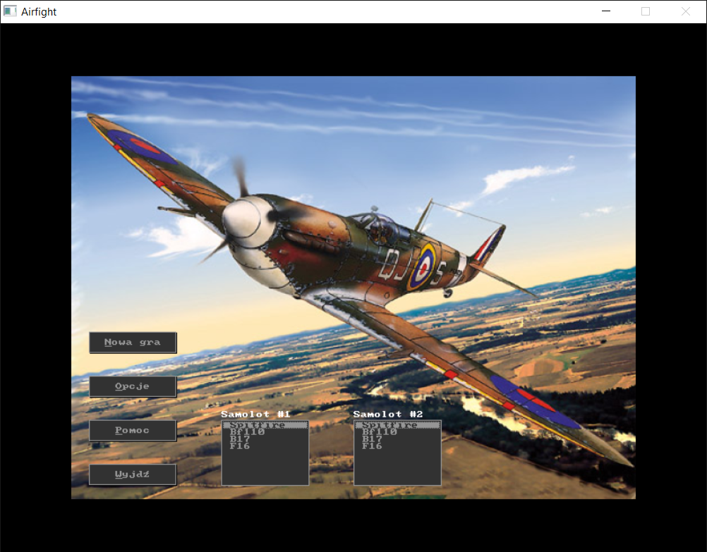
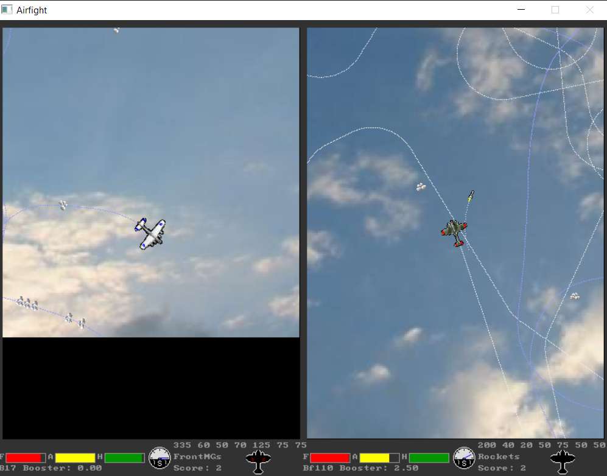

Airfight by Dagothar
====================

1. Introduction (in English)
----------------------------
  
  Airfight is a simple two player aircraft dog-fighting game.
  
  
  
  Features:
  * aircraft combat
  * several aircraft available (Spitfire, Messerschmitt, B27, F17)
  * several weapons (guns, bombs, cannons, missiles, ...)
  * hit zones!
  * fun
  
  

2. Sterowanie.
--------------
  
	* Klawisze gracza #1:
	Góra - zwiększ ciąg
	Dół - włącz/wyłącz dopalacz(o ile istnieje)
	Lewo, prawo - skręt
	Prawy shift - zmień broń
	Prawy control - strzelaj
  
	* Klawisze gracza #2:
	X - zwiększ ciąg
	A - włącz/wyłącz dopalacz(o ile istnieje)
	Z, C - skręt
	Lewy shift - zmień broń
	Lewy control - strzelaj
  
  * Inne:
	P - umieść nowe samoloty na mapie
  
  
3. Opcje.
---------
  
Domyślnie zawijanie mapy jest wyłączone - kiedy samolot wpadnie na krawędź 
mapy, rozbija się. Kiedy zawijanie jest włączone, samolot przelatuje na przeciwległą 
krawędź. Opcja 'Test' przekazuje kontrolę nad samolotem #2 dla procedury, która steruje 
nim losowo, więc wskazane jest włączenie jednocześnie z nią opcji zawijania mapy.
Poszczególne suwaki w opcjach umożliwiają ustawienie czasu na rozgrzewkę(0 - 10 sek.) 
oraz współczynnika obrażeń(0.5 - 2 razy większe niż normalnie).
Suwak odświeżania grafiki nic dobrego nie robi.
  
4.Gra.
------
W grze chodzi o strącenie maszyny przeciwnika przy użyciu wszelkich możliwych środków. 
Strzelanie jest możliwe jedynie po przekroczeniu pewnej prędkości, jednocześnie nie można 
juz potem zwolnić aby się nie rozbić. Samoloty mają strefy trafień - zniszczenie lub 
uszkodzenie sterów wpływa na sterowność, silnika na dynamikę, ubytek paliwa wzrasta 
jeżeli zbiornik jest dziurawy. Kiedy zostanie całkowicie zniszczony, samolot wybucha. 
Zabicie załogi powoduje całkowitą utratę kontroli nad samolotem. Uszkodzona broń ma 
szansę się zacinać.Uszkodzenia przedstawione są schematycznie na ikonach 
samolotów w dolnej części ekranu. Powyżej wypisane są hp poszczególnych części; 
kolejno: kadłuba, silnika, załogi, zbiornika, systemu broni, usterzenia z prawej i lewej 
strony. Czerwony pasek odpowiada poziomowi paliwa, żółty - amunicji aktualnie wybranej broni,
 zielony - stanowi kadłuba.
